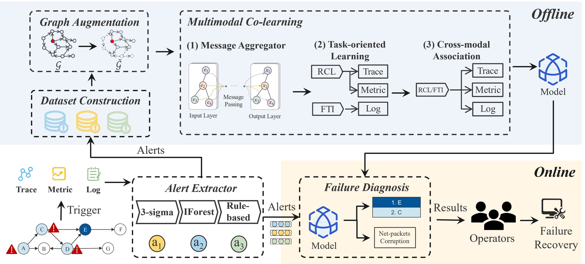

# TVDiag

### TVDiag: A Task-oriented and View-invariant Failure Diagnosis Framework with Multimodal Data

*TVDiag* is a multimodal failure diagnosis framework designed to locate the root cause and identify the failure type in microservice-based systems. This repository offers the core implementation of *TVDiag*.



## Project Structure

```
── config
│   └── exp_config.py
├── core
│   ├── loss
│   │   ├── AutomaticWeightedLoss.py
│   │   ├── SupervisedContrastiveLoss.py
│   │   └── UnsupervisedContrastiveLoss.py
│   ├── model
│   │   ├── backbone
│   │   │   ├── FC.py
│   │   │   ├── sage.py
│   │   ├── Classifier.py
│   │   ├── Encoder.py
│   │   ├── MainModel.py
│   │   └── Voter.py
│   ├── multimodal_dataset.py
│   ├── aug.py
│   ├── ita.py
│   └── TVDiag.py
├── data
│   ├── gaia
│   │   ├── label.csv
│   │   ├── raw
│   │   └── tmp
│   └── sockshop
│       ├── label.csv
│       ├── raw
│       └── tmp
├── helper
│   ├── complexity.py
│   ├── early_stop.py
│   ├── eval.py
│   ├── io_util.py
│   ├── logger.py
│   ├── Result.py
│   ├── scaler.py
│   ├── seed.py
│   └── time_util.py
├── process
│   ├── EventProcess.py
│   └── events
│       ├── cbow.py
│       ├── cnn1d_w2v.py
│       ├── fasttext_w2v.py
│       └── lda_w2v.py
├── LICENSE
├── main.py
├── README.md
```

## Dataset

We conducted experiments on two datasets:

- [GAIA](https://github.com/CloudWise-OpenSource/GAIA-DataSet). GAIA dataset records metrics, traces, and logs of the MicroSS simulation system in July 2021, which consists of ten microservices and some middleware such as Redis, MySQL, and Zookeeper. The extracted events of GAIA can be accessible on [DiagFusion](https://arxiv.org/abs/2302.10512).
- [AIOps-22](https://competition.aiops-challenge.com). The AIOps-22 dataset is derived from the training data released by the AIOps 2022 Challenge, where failures at three levels (node, service, and instance) were injected into a Web-based e-commerce platform [Online-boutique](https://github.com/GoogleCloudPlatform/microservices-demo).
- Sockshop. We deployed a well-known microservice-based system: [Sockshop](https://github.com/microservices-demo/microservices-demo) in a Kubernetes cluster. We induced diverse application failures using Chaos Mesh and gathered approximately 70GB of system telemetry data for testing.  Due to storage constraints, we only provide the extracted alert dataset. You may contact us via email to request the raw data.

## Getting Started

<B>Requirements</B>

- python=3.8.12
- pytorch=2.1.1
- fasttext=0.9.2
- dgl=2.1.0.cu118 (my cuda version is 12.6)


<B>Run</B>

You can run the below commands:

```python
python main.py
```

The parameters in `config/exp_config` are described as follows:

<B>Common args</B>

- `dataset`: The dataset that you want to use.
- `reconstruct`: This parameter represents whether the events should be regenerated. (Default: False)

<B>Model</B>

- `TO`: TO denotes whether the task-oriented learning module should be loaded. (Default: True)
- `CM`: CM denotes whether the cross-modal association should be established. (Default: True)
- `dynamic_weight`: dynamic_weight denotes whether weights are dynamically assigned for each loss. (Default: True)
- `contrastive_loss_scale`: This parameter adjusts the scale of the contrastive loss. (Default: 0.1)
- `temperature`: This parameter adjusts the temprature parameter $\tau$, controlling the the attention to difficult samples. (Default: 0.3)
- `patience`: This parameter adjusts the patience used in early break. (Default: 10)
- `aug_percent`:  The inactivation probability. (Default: 0.2)
